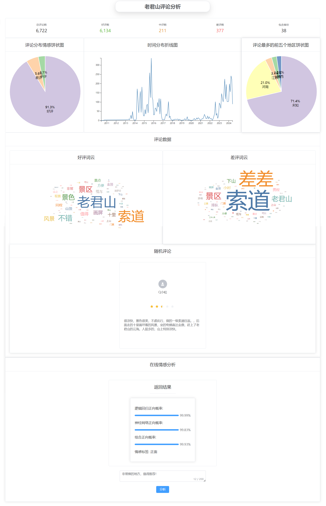

# 主要功能

使用 requests 爬取携程和同程旅游网站的评论数据，使用 SnowNLP 和 SenticNet 情感词典对评论进行情感标注，使用 BERT 模型对评论进行文本向量化，使用逻辑回归和神经网络模型进行情感预测，结合两种模型的预测结果，确定最终的情感标签，将结果保存到新的 CSV 文件中。
可视化使用 Flask 搭建的接口服务，用于前后端交互。Vue.js 框架搭建前端页面，使用 D3.js 进行数据可视化。

- 抓取旅游网站评论数据，以此来训练模型。
- 分析评论情感，提取好评以及差评，以及对应关键词
- 多维度分析好评和差评
- 传入评论返回评论的情感预测值




# 启动

## 启动前端页面

进入前端目录

```bash
cd .\web\vite
```

启动项目开发环境

```bash
npm run dev
```

## 启动后端

直接运行 抓取评论预处理训练一键启动脚本

```python
python train.py
```

之后运行预测程序，对抓取到的原评论内容进行预测

```python
python sentimentAnalysis.py
```

接着启动后端接口供前端访问

```python
python app.py
```


# 后端

## train.py

对于数据的获取和模型的训练，全部整合到了 `main.py` 文件内，直接运行该文件即可。

以下是对该文件内容的介绍。

### 数据获取

数据爬取相关代码在 `.\Component\comments.py`

该段代码爬取 [同程旅游](https://www.ly.com/)，[携程旅游](https://www.ctrip.com/)相关景点的评论数据

以 ['评论时间', 'IP', '用户ID', '昵称', '评论', '评分'] 为键值保存。

调用示例：

```python
import Component.comments as comments
comments.get_comments(ly_poi_id=, ctrip_poi_id=,page_size=50,output_path=)
```

如老君山在同程旅游的id为 8472，携程旅游id为 77806，page_size为抓取时的分页。

### 数据预处理

数据预处理相关代码在`.\Component\preprocess.py`

该段代码对前面获取到的评论内容进行清洗，并使用 jieba 进行分词和去停用词。

调用示例：

```python
import Component.preprocess as preprocess
preprocess.process_data(file_path=, output_path=)
```

停用词词典和自定义分词词典分别为 data 目录下 stop_words.utf8，user_dict.utf8

### 情感标注

数据预处理相关代码在`.\Component\sentimentComments.py`

使用 SnowNLP 和SenticNet情感词典，对评论进行联合标注。

调用示例：

```python
import Component.sentimentComments as sentimentComments
sentimentComments.get_sentiment(file_path=,output_path=)
```

根据参考价值，对标注结果进行按权重赋值，用户评分权重为 1.0，SnowNLP权重为0.6，SenticNet权重为0.4。

### 训练模型

训练逻辑回归模型的相关代码在`.\Component\trainLogisticModel.py`

训练深度学习模型的相关代码在`.\Component\trainNNModel.py`

对评论内容使用BERT 进行文本向量化，以前面标注的情感值为对应标签，分别训练逻辑回归模型和深度学习模型。

调用示例：

```python
import Component.trainLogisticModel as trainLogisticModel
import Component.trainNNModel as trainNNModel
trainLogisticModel.train_logistic_model(file_path=,output_path=)
trainNNModel.train_neural_network_model(file_path=,output_path=)
```

逻辑回归默认训练 2000 轮，可以达到 92% 的正确率。深度学习训练 70 轮，由于数据量不大过多会过拟合，可以达到 92% 的正确率。

## sentimentAnalysis.py

加载和预处理评论数据，使用 BERT 模型进行文本向量化提取文本特征。使用逻辑回归和神经网络模型进行情感预测，结合两种模型的预测结果，确定最终的情感标签，将结果保存到新的 CSV 文件中。

## app.py

使用 Flask 搭建的接口服务，用于前后端交互。

接口文档如下

### 获取评论数量

- **URL**: `/getCmtCount`
- **方法**: `GET`
- **功能**: 获取系统中的评论总数。
- **响应**: `{'count': count}`，其中`count`为评论总数。

### 获取指定IP的评论数量

- **URL**: `/getCmtCountByIP`
- **方法**: `GET`
- **参数**:
  - `ip`: 需要查询的IP地理地址。
- **功能**: 获取指定IP地址的评论数量。
- **响应**: `{'count': count}`，其中`count`为该IP的评论数量。

### 获取IP列表及对应评论数量

- **URL**: `/getIPList`
- **方法**: `GET`
- **功能**: 获取指定数量IP列表，以及对应的评论数量。
- **响应**: IP列表及其对应的评论数量。


### 获取IP归属地的数量

- **URL**: `/getIPCount`
- **方法**: `GET`
- **功能**: 获取所有评论的地区数量。
- **响应**: 所有评论的地区数量。


### 获取指定IP的评论

- **URL**: `/getCmtByIP`
- **方法**: `GET`
- **功能**: 获取指定IP地址及其对应的评论。
- **响应**: 指定IP地址及其对应的评论。


### 获取指定情感的评论数量

- **URL**: `/getCmtCountBySentiment`
- **方法**: `GET`
- **参数**:
  - `sentiment`: 需要查询的情感类型。
- **功能**: 获取指定情感类型的评论数量。
- **响应**: `{'count': count}`，其中`count`为该情感类型的评论数量。

### 获取指定情感的评论

- **URL**: `/getCmtBySentiment`
- **方法**: `GET`
- **参数**:
  - `sentiment`: 需要查询的情感类型。
- **功能**: 获取具有指定情感类型的评论。
- **响应**: 指定情感的评论列表。

### 获取情感列表及对应评论数量

- **URL**: `/getSentimentList`
- **方法**: `GET`
- **功能**: 获取所有情感类型及其对应的评论数量。
- **响应**: 情感列表及其对应的评论数量。

### 获取指定数量的评论

- **URL**: `/getComments`
- **方法**: `GET`
- **参数**:
  - `index`: 起始索引。
  - `end`: 结束索引。
- **功能**: 获取从起始索引到结束索引的评论列表。
- **响应**: 指定范围内的评论列表。

### 获取随机评论

- **URL**: `/getRandomComments`
- **方法**: `GET`
- **功能**: 获取随机一条评论。
- **响应**: 随机评论的内容。

### 获取关键词

- **URL**: `/getKeyword`
- **方法**: `GET`
- **参数**:
  - `topK`: 需要返回的关键词数量。
- **功能**: 获取评论中的关键词及其权重。
- **响应**: 关键词及其权重的列表。

### 获取指定情感的关键词

- **URL**: `/getKeywordBySentiment`
- **方法**: `GET`
- **参数**:
  - `sentiment`: 情感类型。
  - `topK`: 需要返回的关键词数量。
- **功能**: 获取具有指定情感类型的评论中的关键词及其权重。
- **响应**: 关键词及其权重的列表。

### 获取情感

- **URL**: `/getSentiment`
- **方法**: `POST`
- **参数**: 
  - `text`: 需要分析情感的文本。
- **功能**: 分析给定文本的情感。
- **响应**: 文本的情感分析结果。

### 获取不同时间的评论数量

- **URL**: `/getCmtCountByTime`
- **方法**: `GET`
- **功能**: 返回在不用时间的评论数量。
- **响应**: 返回在不用时间的评论数量。